# Multi-digit MNIST for Few-shot Learning

<p align="center">
    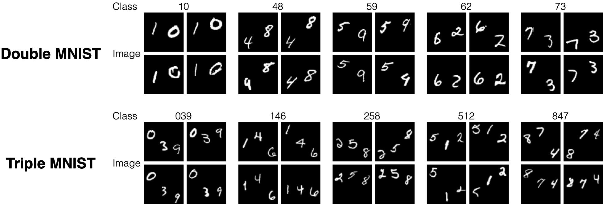
</p>

## Cite this repository

```
@misc{mulitdigitmnist,
  author = {Sun, Shao-Hua},
  title = {Multi-digit MNIST for Few-shot Learning},
  year = {2019},
  journal = {GitHub repository},
  url = {https://github.com/shaohua0116/MultiDigitMNIST},
}
```

### Papers that use this dataset:
- MetaSDF: Meta-learning Signed Distance Functions (NeurIPS 2020): [Paper](https://arxiv.org/abs/2006.09662), [Project page](https://vsitzmann.github.io/metasdf/), [Code](https://github.com/vsitzmann/metasdf)
- Regularizing Deep Multi-Task Networks using Orthogonal Gradients: [Paper](https://arxiv.org/abs/1912.06844)
- GMAIR: Unsupervised Object Detection Based on Spatial Attention and Gaussian Mixture: [Paper](https://arxiv.org/abs/2106.01722)
- Data-free meta learning via knowledge distillation from multiple teachers: [Thesis](https://epub.ub.uni-muenchen.de/75191/1/MA_Gruber_Sebastian.pdf)

## Description

`Multi-digit MNIST` generator creates datasets consisting of handwritten digit images from [MNIST](http://yann.lecun.com/exdb/mnist/) for few-shot image classification and meta-learning. It simply samples images from MNIST dataset and put digits together to create images with multiple digits. It also creates training/validation/testing splits (64/20/16 classes for DoubleMNIST and 640/200/160 for TripleMNIST). 

You can generate customized by following the cammands provided in [Usage](https://github.com/shaohua0116/MultiDigitMNIST#usage) to change the number of images in each class, the image size, etc. You can also download generated datasets from [Datasets](https://github.com/shaohua0116/MultiDigitMNIST#datasets).

This repository benchmarks the performance of **MAML** ([Model-Agnostic Meta-Learning for Fast Adaptation of Deep Networks](https://arxiv.org/abs/1703.03400)) using datasets created via the generation script in a variety of settings.

Some examples of images from the datasets are as follows. 

- Double MNIST Datasets (100 classes: `00` to `99`)

| **Class** | 10 | 48 | 59 | 62 | 73 |
| :---: | :---: | :---: | :---: | :---: | :---: |
| **Image** |     | 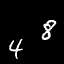 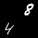 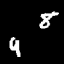 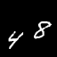| 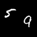 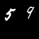 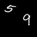 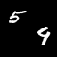 | 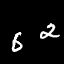 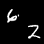 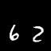 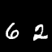 | 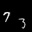 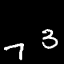 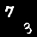 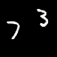 | 

- Triple MNIST Datasets (1000 classes: `000` to `999`)

| **Class** | 039 | 146 | 258 | 512 | 874 |
| :---: | :---: | :---: | :---: | :---: | :---: |
| **Image** | 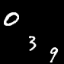 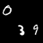 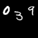 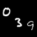 | 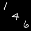 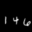 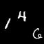 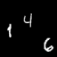| 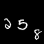 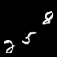 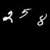 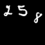 | 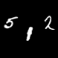 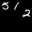 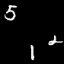  | 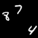 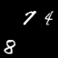 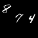 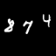 | 

## Prerequisites
- [NumPy](http://www.numpy.org/)
- [imageio](https://pypi.org/project/imageio/)

## Usage

Generate a DoubleMNIST dataset with 1k images for each class

```bash
python generator.py --num_image_per_class 1000 --multimnist_path ./dataset/double_mnist --num_digit 2 --image_size 64 64
```

Generate a TripleMNIST dataset with 1k images for each class

```bash
python generator.py --num_image_per_class 1000 --multimnist_path ./dataset/triple_mnist --num_digit 3 --image_size 84 84
```

### Arguments
- `--mnist_path`: the path to the MNIST dataset (download it if not found)
- `--multimnist_path`: the path to the output Multi-digit MNIST dataset
- `--num_digit`: how many digits in an image
- `--train_val_test_ratio`: determine how many classes for train, val, and test
- `--image_size`: the size of images. Note that the width needs to be larger than `num_digit` * `mnist_width`
- `--num_image_per_class`: how many images for each class
- `--random_seed`: numpy random seed

## Datasets

You can download the generated datasets

| **Dataset** | Image size | Train/Val/Test classes | # of images per class | File size | link |
| :---: | :---: | :---: | :---: |--- | :---: |
| **DoubleMNIST** | (64, 64) | 64, 16, 20 | 1000 | 69MB  | [Google Drive](https://drive.google.com/file/d/1MqQCdLt9TVE3joAMw4FwJp_B8F-htrAo/view?usp=sharing) |
| **TripleMNIST** | (84, 84) | 640, 160, 200 | 1000 | 883MB | [Google Drive](https://drive.google.com/file/d/1xqyW289seXYaDSqD2jaBPMKVAAjPP9ee/view?usp=sharing) |

## Benchmark

This repository benchmarks training **MAML** ([Model-Agnostic Meta-Learning for Fast Adaptation of Deep Networks](https://arxiv.org/abs/1703.03400)) using datasets created via this generation script in a variety of settings.

|  Dataset/Setup   | 5-way 1-shot | 5-way 5-shot | 20-way 1-shot | 20-way 1-shot |
| :------------:   | :----------: | :----------: | :-----------: | :-----------: |
| **Double MNIST** |   97.046%    | in progress  |    85.461%    | in progress   |
| **Triple MNIST** |   98.813%    | in progress  |    96.251%    | in progress   |
| **Omniglot**     |   98.7%      |   99.9%      |    95.8%      |    98.9%      |


Hyperparameters
- `slow learning rate`: 1e-3
- `fast learning rate`: 0.4
- `number of gradient steps`: 1
- `meta batch size`: 12
- `number of conv layers`: 4
- `iterations`: 100k

Training

<p align="center">
    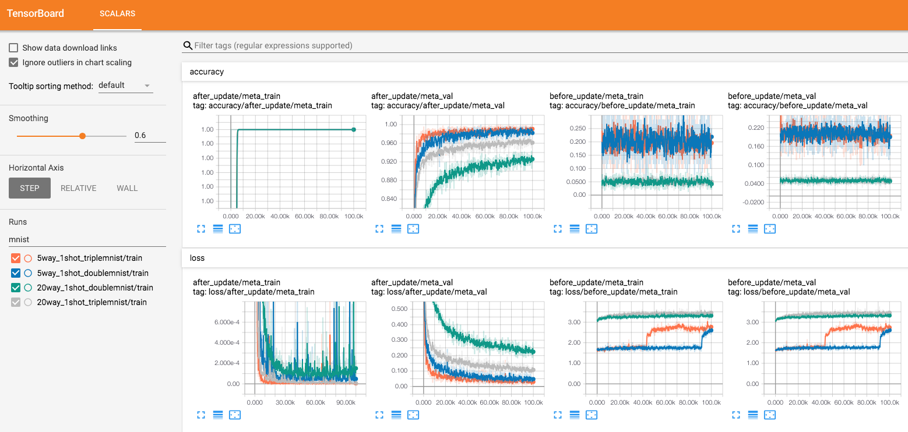
</p>

\*The trainings have not fully converged and the new results will be reported once they are finished.

## Author
[Shao-Hua Sun](http://shaohua0116.github.io/)
